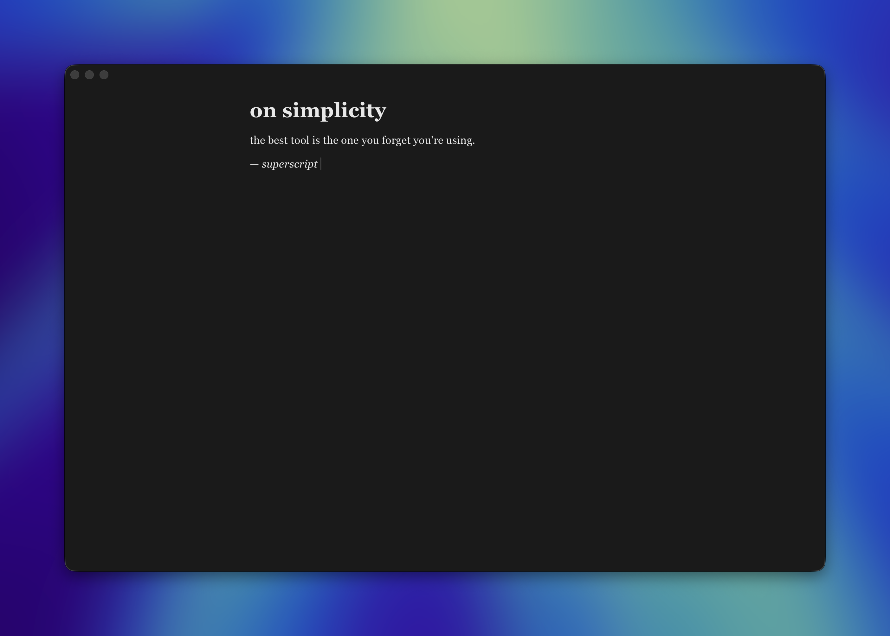

# Superscript

A minimal, distraction-free markdown notes app for macOS built with Tauri v2, React, and ProseMirror.



## Download

Download the latest release from the [releases page](https://github.com/usamaasfar/superscript/releases/latest).

- **Apple Silicon** — download the `aarch64.dmg`
- **Intel** — download the `x64.dmg`

## Keyboard shortcuts

| Shortcut | Action |
|---|---|
| Cmd+K | Open / close command bar |
| Cmd+N | New note |
| Cmd+F | Toggle fullscreen |
| Escape | Close command bar |

## Development

### Prerequisites

- [Bun](https://bun.sh)
- [Rust](https://www.rust-lang.org/tools/install)
- Xcode Command Line Tools (`xcode-select --install`)

### Install dependencies

```bash
bun install
```

### Run in dev mode

```bash
cd apps/desktop
bun tauri dev
```

### Build

```bash
cd apps/desktop
bun tauri build
```

## License

MIT
